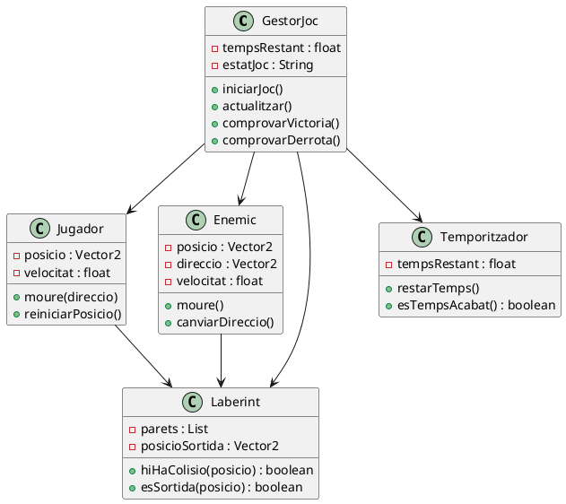
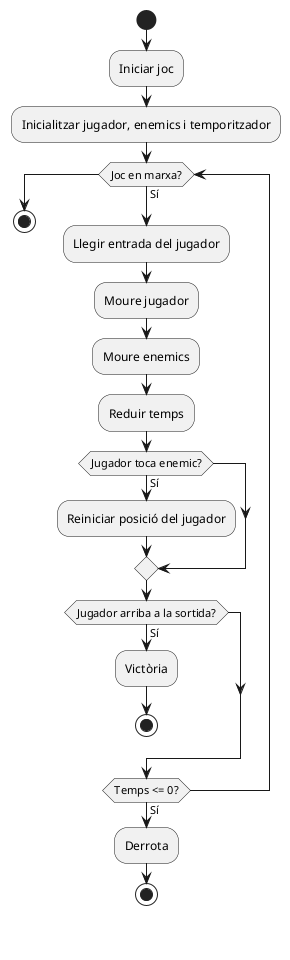

# 02 - Model del joc

## 1. Components principals del joc

El joc està format per diversos sistemes que treballen conjuntament per garantir el funcionament global:

- Sistema de control del jugador (moviment amb teclat)
- Sistema de laberint (estructura de parets i passadissos)
- Sistema d’enemics amb moviment automàtic
- Sistema de temporitzador (compte enrere)
- Sistema de col·lisions (parets, enemics i sortida)
- Sistema d’estats del joc (jugant, victòria, derrota)

---

## 2. Entitats identificades

Les entitats principals del sistema són:

- **Jugador**
- **Enemic**
- **Laberint**
- **GameManager**

---

## 3. Atributs clau de cada entitat

### Jugador
- posicioX  
- posicioY  
- velocitat  

### Enemic
- posicioX  
- posicioY  
- direccio  
- velocitat  

### Laberint
- amplada  
- alçada  
- mapa  

### GameManager
- tempsRestant  
- estatJoc  
- jugador  
- enemics  

---

## 4. Accions, mètodes o funcions principals

### Jugador
- moure(direccio)
- actualitzar()

### Enemic
- moure()
- canviarDireccio()

### Laberint
- esColisio(posicio)

### GameManager
- iniciarJoc()
- actualitzar()
- comprovarVictoria()
- comprovarDerrota()
- reiniciarJugador()

---

## 5. Explicació del diagrama de classes

El diagrama de classes representa l’estructura del sistema i com es relacionen les diferents entitats del joc.

La classe **GameManager** és el nucli del sistema, ja que controla el flux del joc i coordina la resta d’elements. El **Jugador** és l’element controlat per l’usuari, mentre que els **Enemics** són elements autònoms que representen el perill dins del laberint. El **Laberint** defineix l’espai del joc i gestiona les col·lisions.

Aquest disseny permet separar responsabilitats i facilita la implementació posterior en Godot.

### Aquest es el codi que he enganxat a PlantUML:

---

## 6. Explicació del diagrama de comportament

El diagrama de comportament representa el flux principal del joc durant una partida, és a dir, el bucle de joc.

El joc comença amb la inicialització i entra en un bucle mentre l’estat sigui “jugant”. En cada iteració es llegeix el moviment del jugador, s’actualitza la seva posició, es mouen els enemics i es redueix el temps restant.

Després es comproven les condicions del joc:

- si el jugador toca un enemic → es reinicia la seva posició  
- si arriba a la sortida → victòria  
- si el temps arriba a zero → derrota  

### Aquest es el codi que he enganxat a PlantUML:

